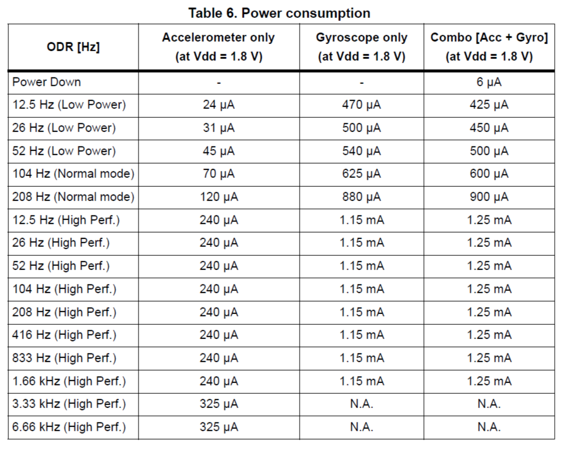

# LSM6DS3 - Driver

<h2>Utilisation de l'accéléromètre 3D</h2>
<h3>Mode de fonctionnement</h3>

<p> Le LSM6DS3 a 3 modes de fonctionnement :
<ul>
  <li><b>Accéléromètre en fonction, gyroscope éteint</b></li>
  <li>Gyroscope en fonction, accéléromètre éteint</li>
  <li>Accéléromètre et gyroscope en fonction avec Output Data Rate (ODR) indépendants</li>
</ul>
Etant donné les besoins de notre application, l'utilisation de l'accéromètre seul suffit, dans un soucis d'optimisation de la consommation énergétique, nous utiliserons le LSM6DS3 en mode "Accelerometer only".</p>

<h3>Consommation - Output Data Rate</h3>
Il existe quelque soit la configuration précédemment choisie, plusieurs modes de consommation: 
<ul>
  <li><b>Low power</b></li>
  <li>Normal</li>
  <li>Hautes performances</li>
</ul>
</p>
<p> </p>

<h3>Configuration</h3>
<p>La configuration pour les deux accéléromètres de notre système sera fixée à la suite de tests sur le système final, une utilisation en mode low power devrait être adaptée. 
configuration actuelle 
<ul>
  <li>Mode accelerometer only</li>
  <li>Output Data Rate : 52 Hz </li>
  <li>Consommation low power : 45 µA</li>
</ul>

<h3>Calcul des angles</h3>
<p>Chaque accéléromètre nous permet de calculer l'accélération selon les trois axes X,Y et Z. Ces accélérations nous permettent de calculer deux angles comme suit : 
<ul>
  <li>
    
  ```c

  Angle_1 = atan2(y.acceleration,z.accelaration)

  ```
  </li>
  <li>
   
   ```c
   Angle_2 = atan2(x.acceleration,z.accelaration)
   ```

  </li>
</ul>
Ces deux angles sont en radians il nous suffit de les convertir en degré.
</p>
